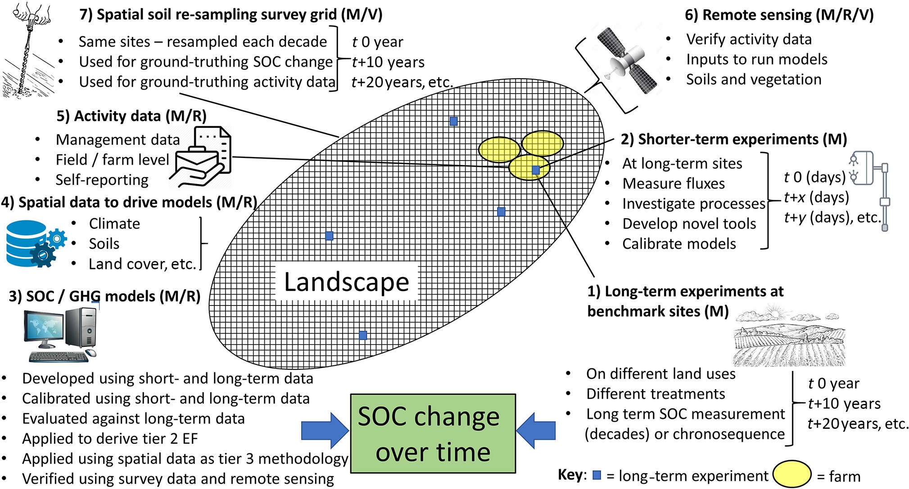

Figure taken from: Smith et al. 2019.  

It's been almost one month since I started my journey as a Researcher at the University of Leeds to work eith the project **Understanding spatio-temporal variability of soil organic carbon under climate change scenarios**. As this is a relative new topic to me, I started to read a lot about soil organic carbon (SOC) monitoring. I already have experience mapping soil properties by digital soil mapping approaches (DSM) using remote sensing variables, soil spectroscopy and machine learning, but not so much about SOC monitoring spatially and over time.  
Therefore, I took some time to learn more about this 'hot' topic and will share with you some important references that helped a lot in my understanding of MRV protocols for SOC monitoring.  

**References:** 
- <a href="https://onlinelibrary.wiley.com/doi/full/10.1111/gcb.14815">Smith et al. (2019)</a>
- <a href="https://www.nytimes.com/2021/11/23/business/dealbook/farm-carbon-credits.html">The latest farm product: carbon credits</a>
- <a href="https://www.goldstandard.org/">The Gold Standard</a>
- <a href="https://www.climateactionreserve.org/">Climate Action Reserve</a>
