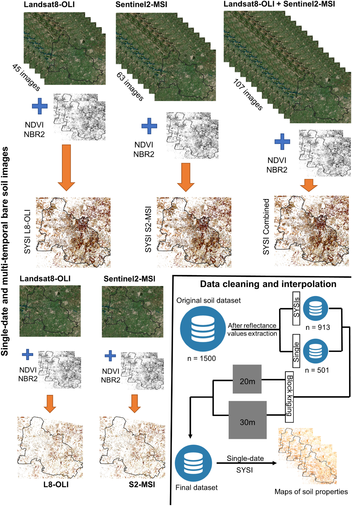
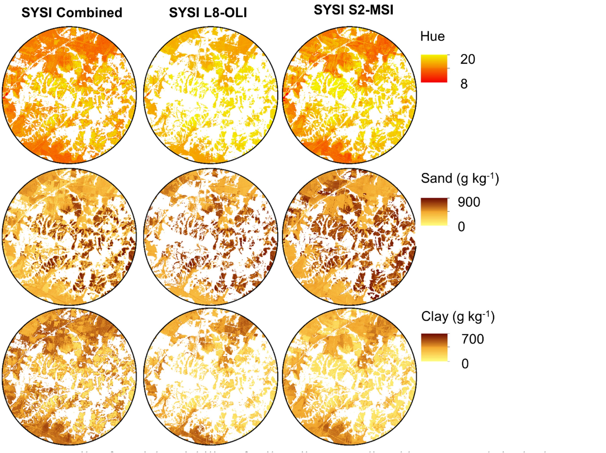

  
  
  
  

This is one of the project of my PhD research. In this work, I aimed to map soil properties (clay content, organic matter, soil color, etc.) using bare soil images of Landsat-8 and Sentinel-2 satellites. For those who are new to this topic or do not understand, the process of digital soil mapping basically consists in applying machine learning algorithms (in my case I used the Cubist) and use the satellites' spectral bands as predictors. In ML terms, this is a supervised learning procedure, where I have a set of training samples with the values of each soil property (each sample have spatial coordinates) and the values of each spectral band.  

I found that, surprisingly, Landsat-8 were better than Sentinel-2 images for mapping topsoil properties in São Paulo. I said surprisingly because my hyphotesis was that Sentinel-2, with better spatial, spectral and temporal resolutions (that is small pixel size, more spectral bands and a high frequency of revisit) would show better results. But that was not the case... Science always surprise us! However, when combined, both images provided better results than separately, lossing detail in terms of spatial resolution because the Sentinel-2 needed to be resampled to 30 meters to fit the spatial resolution of the Landsat-8 image. 

What are my main conclusion from this research? Well, first of all, bare soil images are powerful tools for soil mapping. Second, the combination of images from different satellites will definitely provide better results when aiming to decipher the spatial patterns of soil in tropical regions.

Source: <a href="https://github.com/neli12/soilmapping"><i class="large github icon"></i>soilmapping</a>

You can find the research paper [here](https://www.sciencedirect.com/science/article/pii/S0034425720304909?via%3Dihub#f0010).

