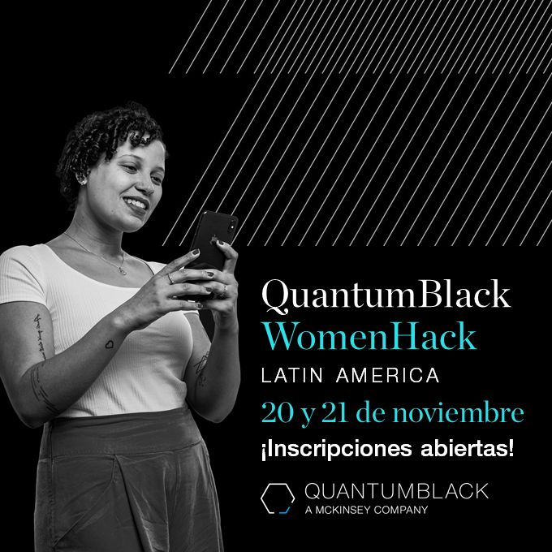

In this example, I will present my experience participating in the Datathon WomanHack promoted by the QuantumBlack, a company from McKinsey.

I confess that at first, I felt nervous because I didn't have so much experience in Python programming and this was my first datathon. Nevertheless, at that time I wanted to participate to gain experience on how a hackaton, or in this case, a datathon works.

The first step was to register for the event and then, the organizing commitee provided access to an app, where we were able to connect with other woman and to form the groups. I match with two incredible girls: Lucía and Angy, from Argentina and Colombia, respectively. The name of our group was Lovelace Squad.
In the first day, we were introduced each other and the organizers presented the challenge, which consisted of creating a model to predict the probability that a client will visit a store in the next 7 days, assuming that no communication is sent. The description of the challenge can be found on [Kaggle](https://www.kaggle.com/c/marketcohackaton/overview/description).

In this project I gained experience on how a Dathaton works and how to work collaboratively with other people. Although this Dathaton was not related to my main study areas, it was a really wonderful experience!

Source: <a href="https://github.com/neli12/data-science/tree/main/MckDatathon"><i class="large github icon"></i>data-science/MckDatathon</a>

