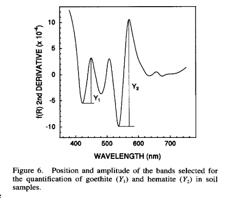

Soil mineralogy is one of the soil properties that is poorly analyzed in soils. The main reasons for this are the need of time-consuming field sampling and expensive chemical reactants, which prevent their inclusion in traditional laboratory analysis. Fortunately, soil spectroscopy can help us with that.  
Generally speaking, which help us to know how much of a specific mineral we have in the soil is the absorption feature observed in spectral curves at specific wavelenghts. Take a look at the image shown below.  

This is the second derivative of the Kubelka-Munk, which is used to enhance a specific absorption feature. This procedure helps to measure how big or small is the absorption feature, which is used to estimate the relative abundance of specific minerals. This tutorial was given to a group of students from Tel Aviv university. In the code source of my github you will found a detailed tutorial in PDF, the scripts and all datasets needed to estimate the relative abundances of minerals in the soil, in this case, hematite and goethite.  

And why we are interested in estimating these minerals in the soil? Because they play a key role in several processes that affect soil fertility, carbon sequestration, organic matter turnover, soil mineralogy, physical quality, etc. Knowing which minerals are present in the soil becomes important because it can help us in having a better understanding of how the soil might behave in these specific processes. 

I hope you enjoy learning about this!  

**References**  

FERNANDES, R.B.A., BARRÓN, V., TORRENT, J., FONTES, M.P.F., 2004. Quantificação de óxidos de ferro de latossolos brasileiros por espectroscopia de refletância difusa. Rev. Bras. Ciênc. Solo 28, 245–257.  
Fernandes, K., Marques Júnior, J., Bahia, A.S.R. de S., Demattê, J.A.M., Ribon, A.A., 2020. Landscapescale spatial variability of kaolinite-gibbsite ratio in tropical soils detected by diffuse reflectance spectroscopy. Catena 195, 104795. https://doi.org/10.1016/j.catena.2020.104795.  
Mendes, W. de S., Demattê, J.A.M., Bonfatti, B.R., de Resende, M.E.B., Campos, L.R., Saraiva da Costa, A.C., 2021. A novel framework to estimate soil mineralogy using soil spectroscopy. Appl. Geochemistry 127, 104909. https://doi.org/10.1016/j.apgeochem.2021.104909.  
POPPIEL, R. R. , LACERDA, M. P. C., RIZZO R., SAFANELLI J. L., BONFATTI B. R. SILVERO N. E. Q., DEMATTÊ J. A. M.. Soil Color and Mineralogy Mapping Using Proximal and Remote Sensing in Midwest Brazil. Remote Sens. 2020, 12, 1197; doi:10.3390/rs12071197.  
Savitzky, A., Golay, M.J.E., 1964. Smoothing and differentiation of data by simplified least squares procedures. Anal. Chem. 36 SCHEINOST, A.C., CHAVERNAS, A., BARRÓN, V., TORRENT, J., 1998. Use and limitations of second derivative diffuse reflectance spectroscopy in the visible to near infrared range to identify and quantify Fe oxides in soils. Clays Clay Miner. 46, 528–536.  
Silva, L.S., Marques Júnior, J., Barrón, V., Gomes, R.P., Teixeira, D.D.B., Siqueira, D.S., Vasconcelos, V., 2020. Spatial variability of iron oxides in soils from Brazilian sandstone and basalt. Catena 185, 104258. https://doi.org/10.1016/j.catena.2019.104258.  
VISCARRA ROSSEL, R.A., BUI, E.N., CARITAT, P., MCKENZIE, N.J., 2010. Mapping iron oxides and the color of Australian soil using visible-near-infrared reflectance spectra. J. Geophys. Earth Surface 115 F04031.  
Viscarra Rossel, R.A., 2011. Fine-resolution multiscale mapping of clay minerals in Australian soils measured with near infrared spectra. J. Geophys. Res. 116, F04023. https://doi.org/10.1029/2011JF001977.  

Code: <a href="https://github.com/neli12/minerals_by_spectra"><i class="large github icon"></i>minerals_by_spectra</a>

