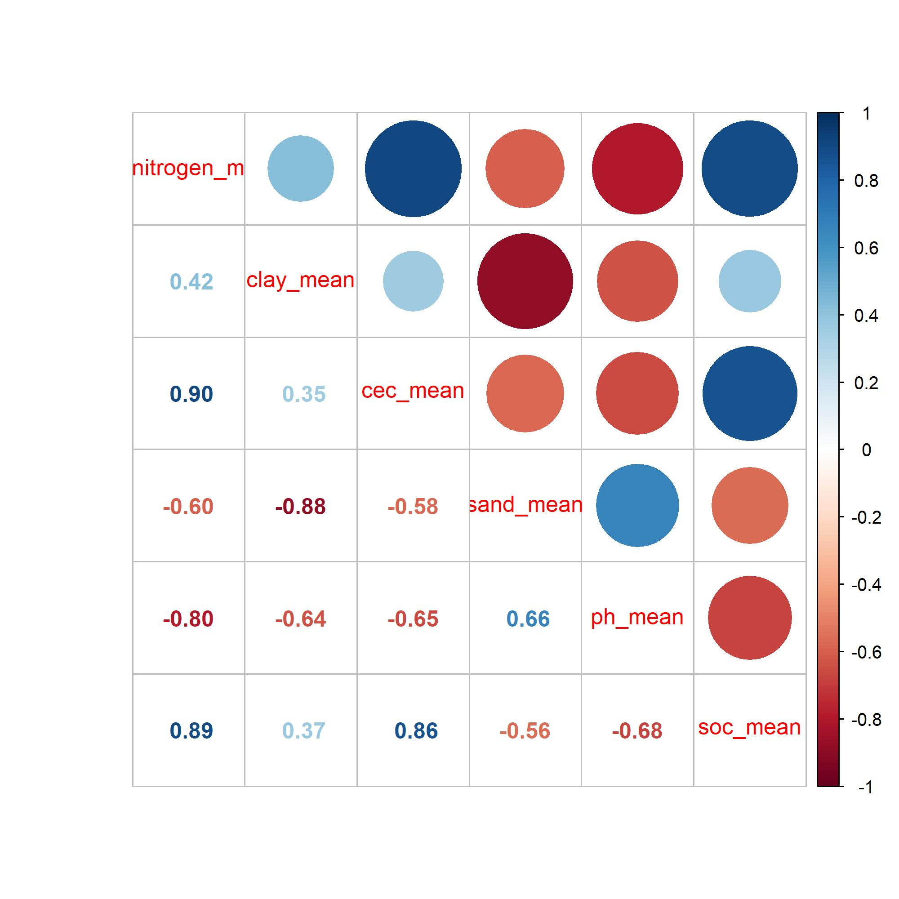
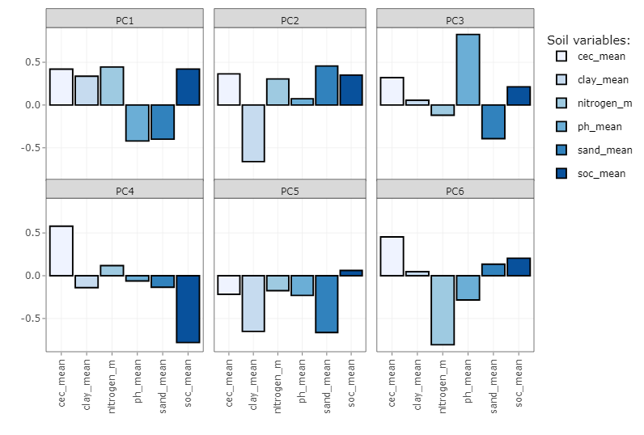
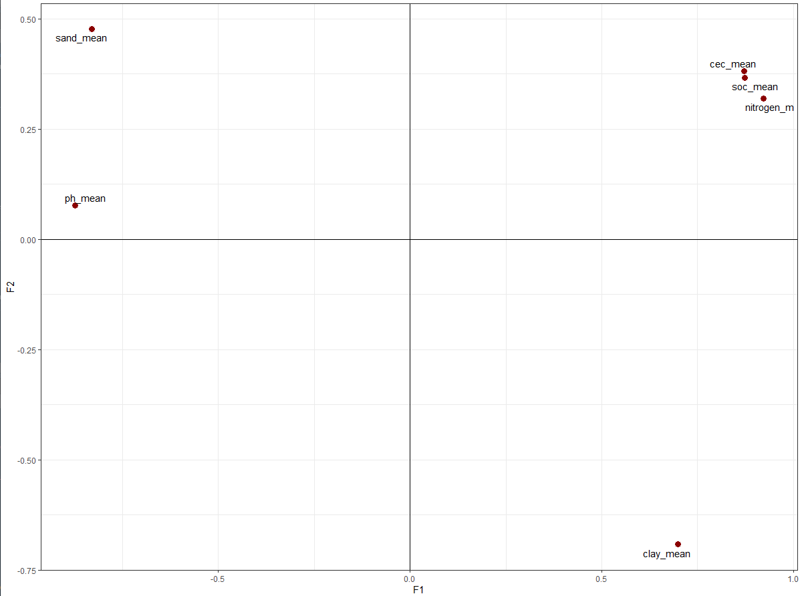
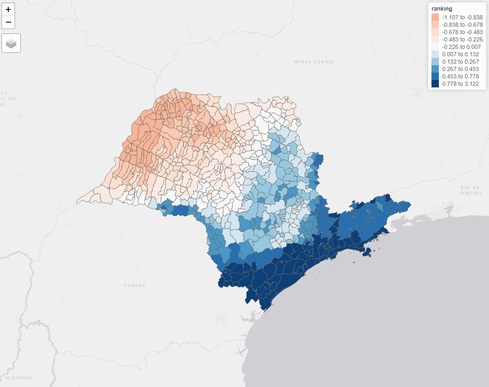

Note 1: This example was adapted from R code examples provided by the University of São Paulo and PECEGE in the MBA in Data Science and Analytics during the classes of PCA and factor analysis taught by Prof. Rafael de Freitas Souza.

Note 2: This is a very simple and regional example developed with soil maps with 250m pixel size. Therefore, it might not be applicable to use at the regional, farm or local level. Better dataset should be used to improve the ranking. 

Hey there! In this project I tried to understand how principal component analysis (PCA) and factor analysis can be used to develop a ranking using soil properties. As an example, I used a shapefile containing the counties of the state of São Paulo and the objective therefore was to visualize which counties have the highest score in the ranking, which probably will indicate better soil conditions. As you might know, PCA and factor analysis are unsupervised machine learning techniques that are used especially to find patterns in the data, for dimensionality reduction between highly correlated variables and to create new unobserved variables (also called latent or principal components). These new variables are orthogonal and are used to explain the variance/covariance between the observed variables.  

In this example, I used six soil properties: soil organic carbon (SOC, g/kg), clay and sand contents (g/kg), nitrogen (cg/kg), cation exchange capacity (CEC, cmolc/kg), and ph (adimensional, which can vary between 0 and 14). These soil properties were retrieved from [soilgrids](https://soilgrids.org/), which is a platform where you can find soil maps for all over the world, maintained by ISRIC from Wageningen University. These soil maps were downloaded from the Google Earth Engine platform, after averaged over six depths. The javascript code can be found [here](https://github.com/neli12/machine-learning-R/blob/main/factor-analysis/download_soilgrids_gee.js).  

After the soil variables were obtained, an average for each county was calculated with the zonal statistics in QGIS. These averages where then used to run PCA first, and then to calculate the factor loadings used to build the ranking. But the first thing to explore is the relationship between the soil properties. With the corrplot shown in the figure below, you can see that all variables have some kind of positive or negative correlation.  

  

The PCA was run and we found that the first PC explained 71% of the variance of the soil properties. With the second PC, we had an explanation of 90%. Very good, isn't? Indeed. This means that almost all variability shown with these soil variables can be explained in two PCs. The positive or negative contribution of each soil property to each PC can be observed below. pH and sand content contribute negatively while all the others have a positive contribution to PC1. It is worth mentioning that SOC, CEC, clay and nitrogen content have a positive influence in the soil system when they are also high in value. pH needs to be around 6.5 to be good for most crops while the lower the sand content, the better soil conditions (until a limit). All these relationships are well represented in the PC1 (I think!, correct me if I am wrong!).  

  

With the first results from the PCA, we then calculated the factor loadings, which basically is the sum of all eigenvalues (square root of the explained variance). Differently from PCA, which has one PC for each variable, in factor analysis you can select the number of factors you want to retain based on a rule. In this case, using the Kaiser's criterion, we retained the factors that had values higher than 1. With this rule, two factors were retained for further analysis. In the biplot displayed below, you can see the distribution of the soil variables and their relationship with each other. More closed variables are more correlated and as you can see, the positive influencing soil variables are in the positive quadrant while the negative influencing variables are in the opposite direction, or negative quadrant (considering just the contributions in the F1).  

  

The score of each factor is then calculated. These values are multiplied to the scaled values (z-score) of the soil variables and then to the explained variance of the first PC. This final calculation will give the ranked values for each county. The more positive the value, the highest the ranking. In other words, if a county in the state of São Paulo has a high positive value, it means that it probably has better soil conditions in terms of adequate CEC, SOC, clay content and nitrogen. However, this ranking should be used with care, as no restrictions were defined before the unsepervised problem was run. Restrictions can be related to, for example, defining an optimal value for these soil variables, as none of them would be beneficial to the soil if they are very high or very low (i.e, pH and clay content). The final map of the ranking of the soil variables can be found in the figure below. In the north parth of the state, where we have a negative value on the ranking (i.e, poorly soil conditions), sand content is higher than the other parts of the state. In these regions, pH, SOC, nitrogen and clay content tend to be low.   

  

And this is all for today. I hope you enjoy learning about this!  

Check out this [youtube video](https://www.youtube.com/watch?v=WV_jcaDBZ2I) for an introduction to factor analysis.  
For an in-depth explanation, check out this [video](https://www.youtube.com/watch?v=E6MfpNOy5Gw).  

Code: <a href="https://github.com/neli12/machine-learning-R/tree/main/factor-analysis"><i class="large github icon"></i>machine-learning-R/factor-analysis</a>

